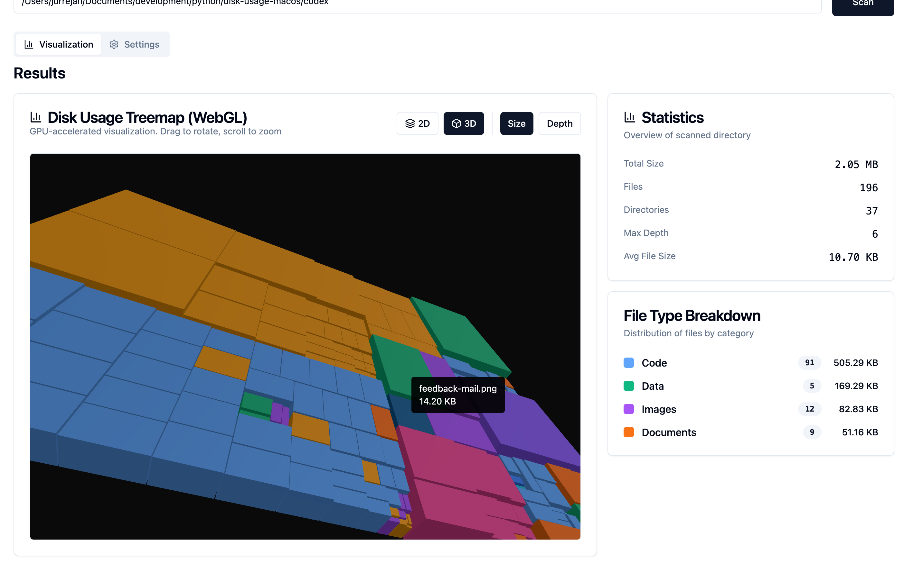
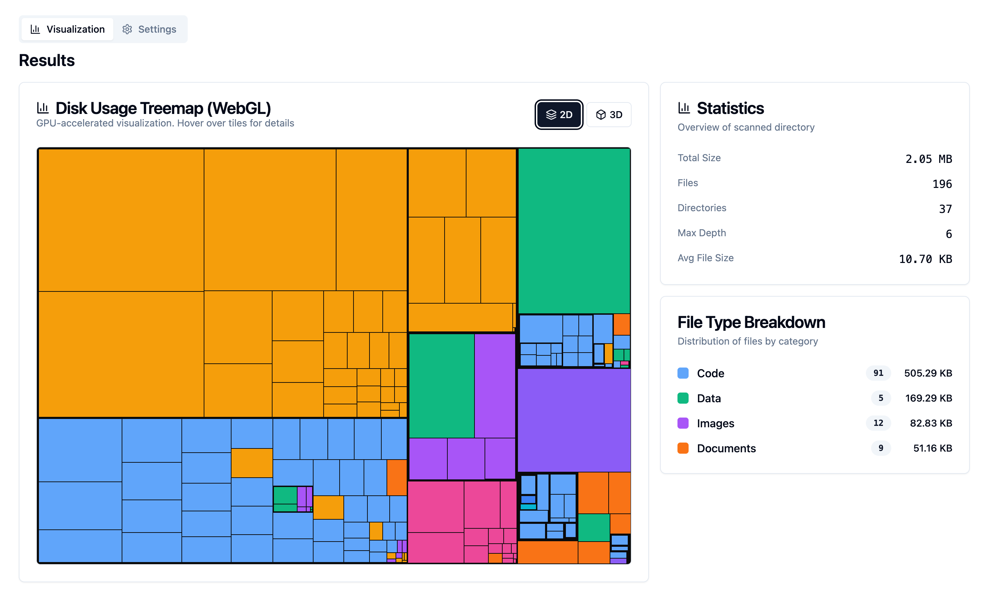

# Disk Usage Analyzer

Modern web-based disk usage analyzer with real-time scanning progress, built with Python (FastAPI) backend and React (shadcn/ui) frontend.

*3D depth visualization showing folder nesting levels*

*Main interface with statistics and file type breakdown*

## ✨ Features

- **Real-time progress tracking** via WebSocket
- **Visual treemap** with D3.js - color-coded by file extension
- **YAML configuration** - all settings in one file
- **Extension templates** - predefined categories (code, documents, images, etc.)
- **Special folder handling** - system folders, dev folders, applications
- **Smart filtering** - excludes node_modules, .git, __pycache__ by default
- **Modern UI** - shadcn/ui components with Tailwind CSS

## 🚀 Quick Start

### Prerequisites

- Python 3.11+
- Node.js 18+
- uv (Python package manager)

### Backend Setup

\`\`\`bash
cd codex

# Create virtual environment
uv venv
source .venv/bin/activate  # On Windows: .venv\Scripts\activate

# Install dependencies
uv pip install -e .[dev]

# Start the backend server
python run_server.py
\`\`\`

Backend will be running at http://localhost:8924

### Frontend Setup

**In a new terminal:**

\`\`\`bash
cd codex/frontend

# Install dependencies
npm install

# Start the development server
npm run dev
\`\`\`

Frontend will be running at http://localhost:5173

### Access the Application

Open your browser and navigate to **http://localhost:5173**

## 📁 Project Structure

\`\`\`
codex/
├── config.yaml              # ALL configuration in one file
├── run_server.py            # Backend server entry point
├── src/diskusage/
│   ├── scanner/
│   │   ├── base.py          # Core abstractions
│   │   ├── local.py         # Sync scanner
│   │   ├── async_scanner.py # Async with progress callbacks
│   │   └── filters.py       # Exclusion patterns
│   ├── model/               # Tree data structures
│   ├── config/
│   │   └── settings.py      # YAML config loader
│   └── web/
│       ├── api.py           # FastAPI REST + WebSocket
│       └── websocket.py     # Progress handler
└── frontend/                # React + shadcn/ui
    ├── src/
    │   ├── components/
    │   │   ├── ui/          # shadcn/ui primitives
    │   │   ├── ScanProgress.tsx
    │   │   ├── FilterSettings.tsx
    │   │   └── TreeMap.tsx
    │   ├── hooks/
    │   │   └── useScanWebSocket.ts
    │   └── App.tsx
    └── package.json
\`\`\`

## ⚙️ Configuration

All configuration is in \`config.yaml\`

## 🔌 API Endpoints

### REST API

- \`GET /\` - API information
- \`POST /api/scan\` - Synchronous scan
- \`GET /api/config\` - Get configuration

### WebSocket

- \`WS /ws/scan?path=<path>\` - Real-time scan with progress updates

## 🎨 Frontend Components

All components use **shadcn/ui** (Radix UI + Tailwind)

## 📦 Dependencies

### Backend
- FastAPI, uvicorn, websockets, pyyaml

### Frontend
- React 18, TypeScript, Vite, shadcn/ui, Tailwind CSS, D3.js, Lucide React

## 📄 License

GPL-2.0-or-later
